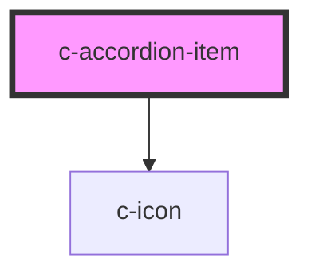

# c-accordion-item

<!-- Auto Generated Below -->

## Properties

| Property      | Attribute     | Description                              | Type               | Default     |
| ------------- | ------------- | ---------------------------------------- | ------------------ | ----------- |
| `collapsable` | `collapsable` | Marks the item as collapsable            | `boolean`          | `false`     |
| `expanded`    | `expanded`    | Expansion status of the item             | `boolean`          | `false`     |
| `heading`     | `heading`     | Heading of the accordion item            | `string`           | `undefined` |
| `outlined`    | `outlined`    | Show an outline around the expanded item | `boolean`          | `false`     |
| `value`       | `value`       | Value of the accordion item              | `number \| string` | `undefined` |

## Events

| Event        | Description                     | Type               |
| ------------ | ------------------------------- | ------------------ |
| `itemChange` | Emit changes to the c-accordion | `CustomEvent<any>` |

## Slots

| Slot             | Description  |
| ---------------- | ------------ |
| `"Default slot"` | Default slot |

## Dependencies

### Depends on

- [c-icon](../c-icon)

### Graph

----------------------------------------------

*Built with [StencilJS](https://stenciljs.com/)*
