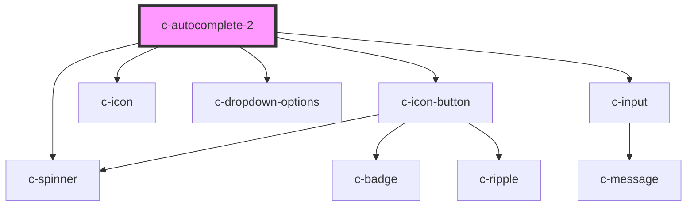

# c-autocomplete-2

<!-- Auto Generated Below -->

## Properties

| Property         | Attribute          | Description                         | Type                                                       | Default            |
| ---------------- | ------------------ | ----------------------------------- | ---------------------------------------------------------- | ------------------ |
| `disabled`       | `disabled`         | Disable the input                   | `boolean`                                                  | `false`            |
| `hideDetails`    | `hide-details`     | Hide the hint and error messages    | `boolean`                                                  | `false`            |
| `hint`           | `hint`             | Hint text for the input             | `string`                                                   | `''`               |
| `hostId`         | `id`               | Id of the element                   | `string`                                                   | `undefined`        |
| `itemsPerPage`   | `items-per-page`   | Items per page before adding scroll | `number`                                                   | `undefined`        |
| `label`          | `label`            | Element label                       | `string`                                                   | `undefined`        |
| `loading`        | `loading`          | Show loading state                  | `boolean`                                                  | `false`            |
| `name`           | `name`             | Input field name                    | `string`                                                   | `undefined`        |
| `placeholder`    | `placeholder`      | Placeholder text                    | `string`                                                   | `''`               |
| `query`          | `query`            | Search string                       | `string`                                                   | `null`             |
| `required`       | `required`         | Show required validation            | `boolean`                                                  | `false`            |
| `shadow`         | `shadow`           | Shadow variant                      | `boolean`                                                  | `false`            |
| `valid`          | `valid`            | Set the validíty of the input       | `boolean`                                                  | `true`             |
| `validate`       | `validate`         | Manual validation                   | `boolean`                                                  | `false`            |
| `validateOnBlur` | `validate-on-blur` | Validate the input on blur          | `boolean`                                                  | `false`            |
| `validation`     | `validation`       | Custom validation message           | `string`                                                   | `'Required field'` |
| `value`          | `value`            | Selected item                       | `CSelectItem & { ref?: HTMLElement; } \| number \| string` | `null`             |

## Events

| Event         | Description                       | Type               |
| ------------- | --------------------------------- | ------------------ |
| `changeQuery` | Triggered when text is typed      | `CustomEvent<any>` |
| `changeValue` | Triggered when option is selected | `CustomEvent<any>` |

## Dependencies

### Depends on

- [c-spinner](../c-spinner)
- [c-icon-button](../c-icon-button)
- [c-icon](../c-icon)
- [c-dropdown-options](../c-dropdown-options)
- [c-input](../c-input)

### Graph

----------------------------------------------

*Built with [StencilJS](https://stenciljs.com/)*
