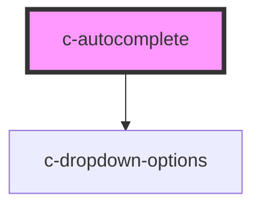

# c-autocomplete

<!-- Auto Generated Below -->

## Properties

| Property            | Attribute             | Description                                                                  | Type                                                       | Default            |
| ------------------- | --------------------- | ---------------------------------------------------------------------------- | ---------------------------------------------------------- | ------------------ |
| `autofocus`         | `autofocus`           | Auto focus the input                                                         | `boolean`                                                  | `false`            |
| `dense`             | `dense`               | Dense variant                                                                | `boolean`                                                  | `undefined`        |
| `disabled`          | `disabled`            | Disable the input                                                            | `boolean`                                                  | `false`            |
| `hideDetails`       | `hide-details`        | Hide the hint and error messages                                             | `boolean`                                                  | `false`            |
| `hint`              | `hint`                | Hint text for the input                                                      | `string`                                                   | `''`               |
| `hostId`            | `id`                  | Id of the element                                                            | `string`                                                   | `undefined`        |
| `items`             | --                    | Items to be selected                                                         | `CAutocompleteItem[]`                                      | `[]`               |
| `itemsPerPage`      | `items-per-page`      | Items per page before adding scroll                                          | `number`                                                   | `undefined`        |
| `label`             | `label`               | Element label                                                                | `string`                                                   | `undefined`        |
| `name`              | `name`                | Input field name                                                             | `string`                                                   | `undefined`        |
| `optionAsSelection` | `option-as-selection` | display the option as selection (works only when c-option elements are used) | `boolean`                                                  | `undefined`        |
| `placeholder`       | `placeholder`         | Placeholder text                                                             | `string`                                                   | `''`               |
| `query`             | `query`               | Search string                                                                | `string`                                                   | `null`             |
| `required`          | `required`            | Show required validation                                                     | `boolean`                                                  | `false`            |
| `returnValue`       | `return-value`        | Return only the item value rather than the whole item object                 | `boolean`                                                  | `undefined`        |
| `shadow`            | `shadow`              | Shadow variant                                                               | `boolean`                                                  | `false`            |
| `valid`             | `valid`               | Set the validíty of the input                                                | `boolean`                                                  | `true`             |
| `validate`          | `validate`            | Manual validation                                                            | `boolean`                                                  | `false`            |
| `validateOnBlur`    | `validate-on-blur`    | Validate the input on blur                                                   | `boolean`                                                  | `false`            |
| `validation`        | `validation`          | Custom validation message                                                    | `string`                                                   | `'Required field'` |
| `value`             | `value`               | Selected item                                                                | `CSelectItem & { ref?: HTMLElement; } \| number \| string` | `null`             |

## Events

| Event         | Description                        | Type               |
| ------------- | ---------------------------------- | ------------------ |
| `changeQuery` | Triggered when text is typed       | `CustomEvent<any>` |
| `changeValue` | Triggered when an item is selected | `CustomEvent<any>` |

## Methods

### `onHideMenu() => Promise<void>`

Hide menu

#### Returns

Type: `Promise<void>`

### `onItemSelection(index: number) => Promise<void>`

Select item by index

#### Returns

Type: `Promise<void>`

### `setActiveDescendant(id: string) => Promise<void>`

#### Returns

Type: `Promise<void>`

### `setValue(event: any, item: any) => Promise<void>`

Sets the value of the autocomplete externally

#### Returns

Type: `Promise<void>`

### `update() => Promise<void>`

Update options when filtering is complete

#### Returns

Type: `Promise<void>`

### `updateQuery(query: string) => Promise<void>`

#### Returns

Type: `Promise<void>`

## Slots

| Slot     | Description                    |
| -------- | ------------------------------ |
| `"post"` | Content added after the input  |
| `"pre"`  | Content added before the input |

## Dependencies

### Depends on

- [c-dropdown-options](../c-dropdown-options)

### Graph

----------------------------------------------

*Built with [StencilJS](https://stenciljs.com/)*
