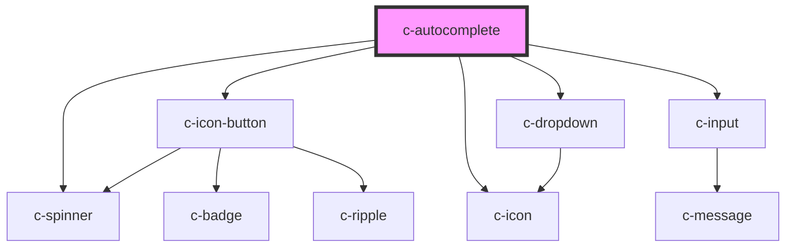

# c-autocomplete

<!-- Auto Generated Below -->

## Properties

| Property                    | Attribute                      | Description                         | Type                                                       | Default                          |
| --------------------------- | ------------------------------ | ----------------------------------- | ---------------------------------------------------------- | -------------------------------- |
| `disabled`                  | `disabled`                     | Disable the input                   | `boolean`                                                  | `false`                          |
| `hideDetails`               | `hide-details`                 | Hide the hint and error messages    | `boolean`                                                  | `false`                          |
| `hint`                      | `hint`                         | Hint text for the input             | `string`                                                   | `''`                             |
| `hostId`                    | `id`                           | Id of the element                   | `string`                                                   | `undefined`                      |
| `items`                     | --                             | Dropdown items                      | `CAutocompleteItem[]`                                      | `[]`                             |
| `itemsPerPage`              | `items-per-page`               | Items per page before adding scroll | `number`                                                   | `6`                              |
| `label`                     | `label`                        | Element label                       | `string`                                                   | `undefined`                      |
| `loading`                   | `loading`                      | Show loading state                  | `boolean`                                                  | `false`                          |
| `minimumQueryLength`        | `minimum-query-length`         | Minimum query length                | `number`                                                   | `0`                              |
| `minimumQueryLengthMessage` | `minimum-query-length-message` | Minimum query length message        | `string`                                                   | `'Type at least {n} characters'` |
| `name`                      | `name`                         | Input field name                    | `string`                                                   | `undefined`                      |
| `noMatchingItemsMessage`    | `no-matching-items-message`    | No matching items message           | `string`                                                   | `'No suggestions found'`         |
| `placeholder`               | `placeholder`                  | Placeholder text                    | `string`                                                   | `''`                             |
| `query`                     | `query`                        | Search string                       | `string`                                                   | `null`                           |
| `required`                  | `required`                     | Show required validation            | `boolean`                                                  | `false`                          |
| `returnObject`              | `return-object`                | Return object instead of value      | `boolean`                                                  | `false`                          |
| `shadow`                    | `shadow`                       | Shadow variant                      | `boolean`                                                  | `false`                          |
| `valid`                     | `valid`                        | Set the validíty of the input       | `boolean`                                                  | `true`                           |
| `validate`                  | `validate`                     | Manual validation                   | `boolean`                                                  | `false`                          |
| `validateOnBlur`            | `validate-on-blur`             | Validate the input on blur          | `boolean`                                                  | `false`                          |
| `validation`                | `validation`                   | Custom validation message           | `string`                                                   | `'Required field'`               |
| `value`                     | `value`                        | Selected item                       | `CSelectItem & { ref?: HTMLElement; } \| number \| string` | `null`                           |

## Events

| Event         | Description                       | Type               |
| ------------- | --------------------------------- | ------------------ |
| `changeQuery` | Triggered when text is typed      | `CustomEvent<any>` |
| `changeValue` | Triggered when option is selected | `CustomEvent<any>` |

## Methods

### `reset() => Promise<void>`

Reset autocomplete state

#### Returns

Type: `Promise<void>`

## CSS Custom Properties

| Name                                             | Description                                |
| ------------------------------------------------ | ------------------------------------------ |
| `--c-autocomplete-active-color`                  | Autocomplete active color                  |
| `--c-autocomplete-background-color`              | Autocomplete background color              |
| `--c-autocomplete-inactive-color`                | Autocomplete inactive color                |
| `--c-autocomplete-option-background-color`       | Autocomplete option background color       |
| `--c-autocomplete-option-background-hover-color` | Autocomplete option background hover color |
| `--c-autocomplete-option-text-color`             | Autocomplete option text color             |
| `--c-autocomplete-placeholder-color`             | Autocomplete placeholder color             |
| `--c-autocomplete-text-color`                    | Autocomplete text color                    |

## Dependencies

### Depends on

- [c-spinner](../c-spinner)
- [c-icon-button](../c-icon-button)
- [c-icon](../c-icon)
- [c-dropdown](../c-dropdown)
- [c-input](../c-input)

### Graph

----------------------------------------------

*Built with [StencilJS](https://stenciljs.com/)*
