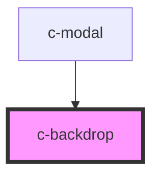

# c-backdrop

<!-- Auto Generated Below -->

## Properties

| Property              | Attribute               | Description                  | Type      | Default |
| --------------------- | ----------------------- | ---------------------------- | --------- | ------- |
| `disableBackdropBlur` | `disable-backdrop-blur` | Disable backdrop blur effect | `boolean` | `false` |

## Dependencies

### Used by

 - [c-modal](../c-modal)

### Graph

----------------------------------------------

*Built with [StencilJS](https://stenciljs.com/)*
