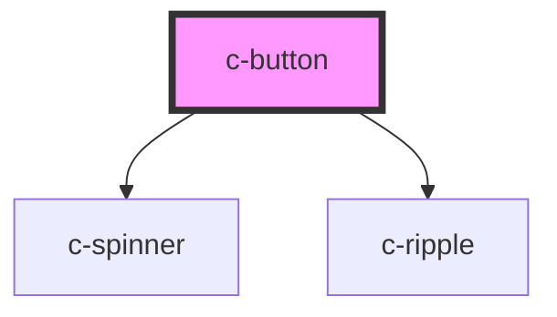

# c-button

<!-- Auto Generated Below -->

## Properties

| Property   | Attribute   | Description                                         | Type                              | Default     |
| ---------- | ----------- | --------------------------------------------------- | --------------------------------- | ----------- |
| `danger`   | `danger`    | Danger variant style                                | `boolean`                         | `false`     |
| `disabled` | `disabled`  | Disable the button                                  | `boolean`                         | `false`     |
| `fit`      | `fit`       | Fit width to containing element                     | `boolean`                         | `false`     |
| `ghost`    | `ghost`     | Light button background                             | `boolean`                         | `false`     |
| `grouped`  | `grouped`   | True when used as a tab button                      | `boolean`                         | `false`     |
| `hostId`   | `id`        | Id of the button                                    | `string`                          | `undefined` |
| `href`     | `href`      | Hyperlink url                                       | `string`                          | `undefined` |
| `iconEnd`  | `icon-end`  | Icon after text                                     | `boolean`                         | `false`     |
| `inverted` | `inverted`  | Inverted button style for dark backgrounds          | `boolean`                         | `false`     |
| `loading`  | `loading`   | Display loader on the button                        | `boolean`                         | `false`     |
| `noRadius` | `no-radius` | Remove the default border radius                    | `boolean`                         | `false`     |
| `outlined` | `outlined`  | Outlined button style                               | `boolean`                         | `false`     |
| `path`     | `path`      | Path for the svg icon                               | `string`                          | `null`      |
| `size`     | `size`      | Size of the button                                  | `"default" \| "large" \| "small"` | `'default'` |
| `target`   | `target`    | Hyperlink target                                    | `string`                          | `'_blank'`  |
| `text`     | `text`      | Transparent button background                       | `boolean`                         | `false`     |
| `type`     | `type`      | Button type                                         | `"button" \| "submit"`            | `'button'`  |
| `value`    | `value`     | Value for the button - for use in the c-tab-buttons | `number \| string`                | `undefined` |

## Events

| Event       | Description                | Type                            |
| ----------- | -------------------------- | ------------------------------- |
| `tabChange` | Emit changes to the parent | `CustomEvent<number \| string>` |

## Slots

| Slot             | Description                                              |
| ---------------- | -------------------------------------------------------- |
| `"Default slot"` | Button text                                              |
| `"description"`  | Additional description to be shown below the button text |
| `"icon"`         | Icon                                                     |

## Dependencies

### Depends on

- [c-spinner](../c-spinner)
- [c-ripple](../c-ripple)

### Graph

----------------------------------------------

*Built with [StencilJS](https://stenciljs.com/)*
