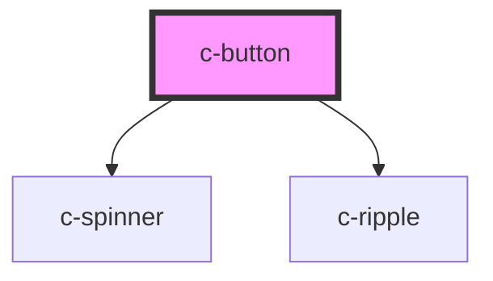

# c-button

<!-- Auto Generated Below -->

## Properties

| Property   | Attribute   | Description                                         | Type                              | Default     |
| ---------- | ----------- | --------------------------------------------------- | --------------------------------- | ----------- |
| `danger`   | `danger`    | Danger variant style                                | `boolean`                         | `false`     |
| `disabled` | `disabled`  | Disable the button                                  | `boolean`                         | `false`     |
| `fit`      | `fit`       | Fit width to containing element                     | `boolean`                         | `false`     |
| `ghost`    | `ghost`     | Light button background                             | `boolean`                         | `false`     |
| `grouped`  | `grouped`   | True when used as a tab button                      | `boolean`                         | `false`     |
| `hostId`   | `id`        | Id of the button                                    | `string`                          | `undefined` |
| `href`     | `href`      | Hyperlink url                                       | `string`                          | `undefined` |
| `iconEnd`  | `icon-end`  | Icon after text                                     | `boolean`                         | `false`     |
| `inverted` | `inverted`  | Inverted button style for dark backgrounds          | `boolean`                         | `false`     |
| `loading`  | `loading`   | Display loader on the button                        | `boolean`                         | `false`     |
| `noRadius` | `no-radius` | Remove the default border radius                    | `boolean`                         | `false`     |
| `outlined` | `outlined`  | Outlined button style                               | `boolean`                         | `false`     |
| `path`     | `path`      | Path for the svg icon                               | `string`                          | `null`      |
| `size`     | `size`      | Size of the button                                  | `"default" \| "large" \| "small"` | `'default'` |
| `target`   | `target`    | Hyperlink target                                    | `string`                          | `'_blank'`  |
| `text`     | `text`      | Transparent button background                       | `boolean`                         | `false`     |
| `type`     | `type`      | Button type                                         | `"button" \| "submit"`            | `'button'`  |
| `value`    | `value`     | Value for the button - for use in the c-tab-buttons | `number \| string`                | `undefined` |

## Events

| Event       | Description                | Type                            |
| ----------- | -------------------------- | ------------------------------- |
| `tabChange` | Emit changes to the parent | `CustomEvent<number \| string>` |

## Slots

| Slot             | Description                                              |
| ---------------- | -------------------------------------------------------- |
| `"Default slot"` | Button text                                              |
| `"description"`  | Additional description to be shown below the button text |
| `"icon"`         | Icon                                                     |

## CSS Custom Properties

| Name                                                     | Description                                        |
| -------------------------------------------------------- | -------------------------------------------------- |
| `--c-button-background-color`                            | Default button background color                    |
| `--c-button-background-color-hover`                      | Default button hover background color              |
| `--c-button-danger-background-color`                     | Danger button background color                     |
| `--c-button-danger-background-color-hover`               | Danger button hover background color               |
| `--c-button-danger-disabled-background-color`            | Disabled danger button background color            |
| `--c-button-danger-disabled-text-color`                  | Disabled danger button text color                  |
| `--c-button-danger-inverted-background-color`            | Inverted danger button background color            |
| `--c-button-danger-inverted-background-color-hover`      | Inverted danger button hover background color      |
| `--c-button-danger-inverted-disabled-background-color`   | Disabled inverted danger button background color   |
| `--c-button-danger-inverted-disabled-text-color`         | Disabled inverted danger button text color         |
| `--c-button-danger-inverted-text-color`                  | Inverted danger button text color                  |
| `--c-button-danger-loader-color`                         | Danger button loader color                         |
| `--c-button-danger-text-color`                           | Danger button text color                           |
| `--c-button-disabled-background-color`                   | Disabled button background color                   |
| `--c-button-disabled-text-color`                         | Disabled button text color                         |
| `--c-button-ghost-background-color`                      | Ghost button background color                      |
| `--c-button-ghost-background-color-hover`                | Ghost button hover background color                |
| `--c-button-ghost-disabled-background-color`             | Disabled ghost button background color             |
| `--c-button-ghost-disabled-text-color`                   | Disabled ghost button text color                   |
| `--c-button-ghost-inverted-background-color`             | Inverted ghost button background color             |
| `--c-button-ghost-inverted-background-color-hover`       | Inverted ghost button hover text color             |
| `--c-button-ghost-inverted-disabled-background-color`    | Disabled inverted ghost button background color    |
| `--c-button-ghost-inverted-disabled-text-color`          | Disabled inverted ghost button text color          |
| `--c-button-ghost-inverted-text-color`                   | Inverted ghost button text color                   |
| `--c-button-ghost-loader-color`                          | Ghost button loader color                          |
| `--c-button-ghost-text-color`                            | Ghost button text color                            |
| `--c-button-inverted-background-color`                   | Inverted default button background color           |
| `--c-button-inverted-background-color-hover`             | Inverted default button hover background color     |
| `--c-button-inverted-disabled-background-color`          | Inverted disabled default button background color  |
| `--c-button-inverted-disabled-text-color`                | Inverted disabled default button text color        |
| `--c-button-inverted-text-color`                         | Inverted default button text color                 |
| `--c-button-loader-color`                                | Default button loader color                        |
| `--c-button-outlined-background-color`                   | Outlined button background color                   |
| `--c-button-outlined-background-color-hover`             | Outlined button hover background color             |
| `--c-button-outlined-border-color`                       | Outlined button border color                       |
| `--c-button-outlined-disabled-background-color`          | Disabled outlined button background color          |
| `--c-button-outlined-disabled-border-color`              | Disabled outlined button border color              |
| `--c-button-outlined-disabled-text-color`                | Disabled outlined button text color                |
| `--c-button-outlined-inverted-background-color`          | Inverted outlined button background color          |
| `--c-button-outlined-inverted-border-color`              | Inverted outlined button border color              |
| `--c-button-outlined-inverted-disabled-background-color` | Disabled inverted outlined button background color |
| `--c-button-outlined-inverted-disabled-border-color`     | Disabled inverted outlined button border color     |
| `--c-button-outlined-inverted-disabled-text-color`       | Disabled inverted outlined button text color       |
| `--c-button-outlined-inverted-text-color`                | Inverted outlined button text color                |
| `--c-button-outlined-loader-color`                       | Outlined button loader color                       |
| `--c-button-outlined-text-color`                         | Outlined button text color                         |
| `--c-button-text-background-color`                       | Text button background color                       |
| `--c-button-text-background-color-hover`                 | Text button hover background color                 |
| `--c-button-text-color`                                  | Default button text color                          |
| `--c-button-text-disabled-background-color`              | Disabled text button background color              |
| `--c-button-text-disabled-text-color`                    | Disabled text button text color                    |
| `--c-button-text-inverted-background-color`              | Inverted text button background color              |
| `--c-button-text-inverted-background-color-hover`        | Inverted text button hover background color        |
| `--c-button-text-inverted-disabled-background-color`     | Disabled inverted text button background color     |
| `--c-button-text-inverted-disabled-text-color`           | Disabled inverted text button text color           |
| `--c-button-text-inverted-text-color`                    | Inverted text button text color                    |
| `--c-button-text-loader-color`                           | Text button loader color                           |
| `--c-button-text-text-color`                             | Text button text color                             |

## Dependencies

### Depends on

- [c-spinner](../c-spinner)
- [c-ripple](../c-ripple)

### Graph

----------------------------------------------

*Built with [StencilJS](https://stenciljs.com/)*
