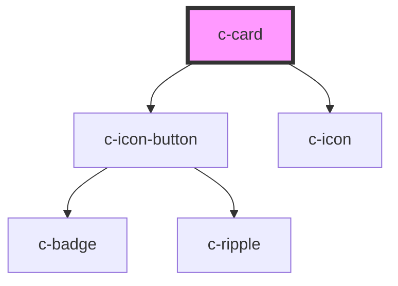

# c-card

<!-- Auto Generated Below -->

## Properties

| Property     | Attribute    | Description                         | Type      | Default |
| ------------ | ------------ | ----------------------------------- | --------- | ------- |
| `fullscreen` | `fullscreen` | Enable the fullscreen toggle button | `boolean` | `false` |

## Methods

### `enterFullscreen() => Promise<void>`

Enter fullscreen from the outside

#### Returns

Type: `Promise<void>`

### `exitFullscreen() => Promise<void>`

Exit fullscreen from the outside

#### Returns

Type: `Promise<void>`

## Slots

| Slot             | Description     |
| ---------------- | --------------- |
| `"Default slot"` | Card components |

## CSS Custom Properties

| Name                        | Description               |
| --------------------------- | ------------------------- |
| `--c-card-background-color` | Card background color     |
| `--c-card-gap`              | Card column gap / padding |

## Dependencies

### Depends on

- [c-icon-button](../c-icon-button)
- [c-icon](../c-icon)

### Graph

----------------------------------------------

*Built with [StencilJS](https://stenciljs.com/)*
