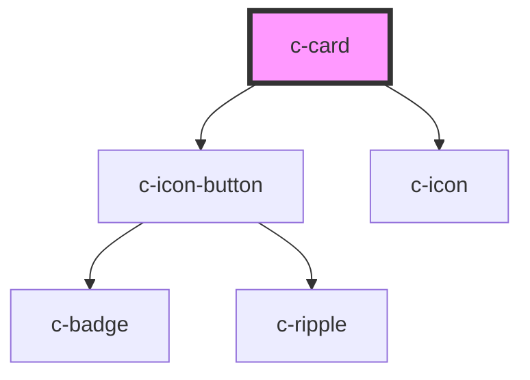

# c-card

<!-- Auto Generated Below -->

## Properties

| Property          | Attribute          | Description                                                | Type                            | Default     |
| ----------------- | ------------------ | ---------------------------------------------------------- | ------------------------------- | ----------- |
| `background`      | `background`       | Card background image for login pages of specific services | `"allas" \| "mahti" \| "puhti"` | `undefined` |
| `backgroundColor` | `background-color` | Background color                                           | `string`                        | `'white'`   |
| `fullscreen`      | `fullscreen`       | Enable the fullscreen toggle button                        | `boolean`                       | `false`     |

## Methods

### `enterFullscreen() => Promise<void>`

Enter fullscreen from the outside

#### Returns

Type: `Promise<void>`

### `exitFullscreen() => Promise<void>`

Exit fullscreen from the outside

#### Returns

Type: `Promise<void>`

## Slots

| Slot             | Description     |
| ---------------- | --------------- |
| `"Default slot"` | Card components |

## Dependencies

### Depends on

- [c-icon-button](../c-icon-button)
- [c-icon](../c-icon)

### Graph

----------------------------------------------

*Built with [StencilJS](https://stenciljs.com/)*
