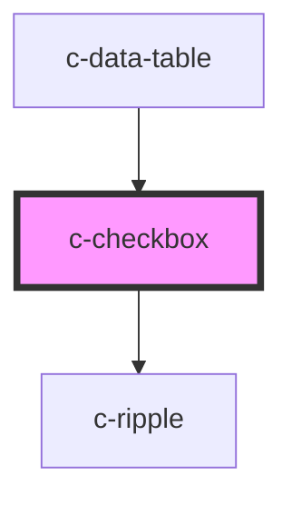

# c-checkbox

<!-- Auto Generated Below -->

## Properties

| Property        | Attribute       | Description                                                                       | Type                | Default            |
| --------------- | --------------- | --------------------------------------------------------------------------------- | ------------------- | ------------------ |
| `checked`       | `checked`       | If `true`, the checkbox is selected.                                              | `boolean`           | `false`            |
| `disabled`      | `disabled`      | Disable the checkbox                                                              | `boolean`           | `false`            |
| `falseValue`    | `false-value`   | The value when the checkbox is unchecked                                          | `boolean \| string` | `false`            |
| `hideDetails`   | `hide-details`  | Hide the hint and error messages                                                  | `boolean`           | `false`            |
| `hint`          | `hint`          | Hint text for the input                                                           | `string`            | `''`               |
| `hostName`      | `name`          | Name of the input - Only used when the checkbox participates in a native `<form>` | `string`            | `undefined`        |
| `indeterminate` | `indeterminate` | Indeterminate state                                                               | `boolean`           | `false`            |
| `label`         | `label`         | Element label                                                                     | `string`            | `''`               |
| `required`      | `required`      | Set as required                                                                   | `boolean`           | `false`            |
| `trueValue`     | `true-value`    | The value when the checkbox is checked                                            | `boolean \| string` | `true`             |
| `valid`         | `valid`         | Set the validity of the input                                                     | `boolean`           | `true`             |
| `validation`    | `validation`    | Custom validation message                                                         | `string`            | `'Required field'` |
| `value`         | `value`         | The input value - Only used when the checkbox participates in a native `<form>`   | `boolean \| string` | `false`            |

## Events

| Event         | Description                                    | Type               |
| ------------- | ---------------------------------------------- | ------------------ |
| `changeValue` | Triggered when element is checked or unchecked | `CustomEvent<any>` |

## Slots

| Slot             | Description                |
| ---------------- | -------------------------- |
| `"Default slot"` | Default slot for the label |

## Dependencies

### Used by

 - [c-data-table](../c-data-table)

### Depends on

- [c-ripple](../c-ripple)

### Graph

----------------------------------------------

*Built with [StencilJS](https://stenciljs.com/)*
