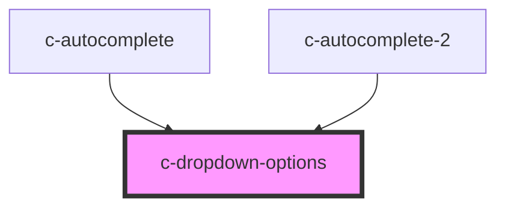

# c-dropdown-options

<!-- Auto Generated Below -->

## Properties

| Property       | Attribute        | Description                         | Type                                                                          | Default     |
| -------------- | ---------------- | ----------------------------------- | ----------------------------------------------------------------------------- | ----------- |
| `hostId`       | `id`             | Id of the element                   | `string`                                                                      | `undefined` |
| `index`        | `index`          | Current index value                 | `number`                                                                      | `undefined` |
| `itemsPerPage` | `items-per-page` | Items per page before adding scroll | `number`                                                                      | `undefined` |
| `options`      | --               | Dropdown options                    | `NodeListOf<HTMLCOptionElement>`                                              | `undefined` |
| `parent`       | --               | Dropdown parent                     | `HTMLCAutocomplete2Element \| HTMLCAutocompleteElement \| HTMLCSelectElement` | `undefined` |
| `type`         | `type`           | Type of the parent element          | `"autocomplete" \| "select"`                                                  | `undefined` |

## Events

| Event                 | Description                             | Type                   |
| --------------------- | --------------------------------------- | ---------------------- |
| `dropdownStateChange` | Triggered when dropdown opens or closes | `CustomEvent<boolean>` |
| `selectOption`        | Triggered when option is selected       | `CustomEvent<any>`     |

## Methods

### `close() => Promise<void>`

Open dropdown

#### Returns

Type: `Promise<void>`

### `focusItem(index: number) => Promise<void>`

#### Returns

Type: `Promise<void>`

### `open() => Promise<void>`

Open dropdown

#### Returns

Type: `Promise<void>`

### `selectItem(index: number) => Promise<boolean>`

Select item

#### Returns

Type: `Promise<boolean>`

the disabled status of the input

### `setStatusText(text: string) => Promise<void>`

#### Returns

Type: `Promise<void>`

### `updateList() => Promise<void>`

Update list items

#### Returns

Type: `Promise<void>`

## Dependencies

### Used by

 - [c-autocomplete](../c-autocomplete)
 - [c-autocomplete-2](../c-autocomplete-2)

### Graph

----------------------------------------------

*Built with [StencilJS](https://stenciljs.com/)*
