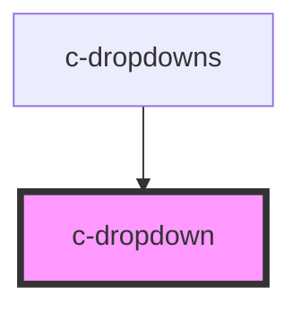

# c-dropdown

<!-- Auto Generated Below -->

## Properties

| Property       | Attribute        | Description                         | Type                                             | Default     |
| -------------- | ---------------- | ----------------------------------- | ------------------------------------------------ | ----------- |
| `index`        | `index`          | Initial value index                 | `number`                                         | `undefined` |
| `inputId`      | `input-id`       | Id of the input element             | `string`                                         | `undefined` |
| `isOpen`       | `is-open`        | Dropdown open state                 | `boolean`                                        | `false`     |
| `items`        | --               | Dropdown items                      | `CSelectItem[]`                                  | `[]`        |
| `itemsPerPage` | `items-per-page` | Items per page before adding scroll | `number`                                         | `undefined` |
| `options`      | --               | Dropdown options                    | `Map<string, HTMLCOptionElement>`                | `undefined` |
| `parent`       | --               | Dropdown parent                     | `HTMLCAutocompleteElement \| HTMLCSelectElement` | `undefined` |
| `wrapper`      | --               | Dropdown scrolling parent           | `HTMLElement`                                    | `undefined` |

## CSS Custom Properties

| Name                                  | Description                      |
| ------------------------------------- | -------------------------------- |
| `--c-dropdown-background-color`       | Menu background color            |
| `--c-dropdown-background-color-hover` | Menu item hover background color |
| `--c-dropdown-text-color`             | Menu item text color             |
| `--c-dropdown-text-color-active`      | Active menu item text color      |

## Dependencies

### Used by

 - [c-dropdowns](../c-dropdowns)

### Graph

----------------------------------------------

*Built with [StencilJS](https://stenciljs.com/)*
