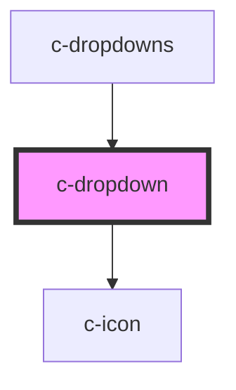

# c-dropdown

<!-- Auto Generated Below -->

## Properties

| Property       | Attribute        | Description                         | Type                                             | Default     |
| -------------- | ---------------- | ----------------------------------- | ------------------------------------------------ | ----------- |
| `focusList`    | `focus-list`     | Focus dropdown on open              | `boolean`                                        | `undefined` |
| `index`        | `index`          | Initial value index                 | `number`                                         | `undefined` |
| `inputId`      | `input-id`       | Id of the input element             | `string`                                         | `undefined` |
| `isOpen`       | `is-open`        | Dropdown open state                 | `boolean`                                        | `false`     |
| `items`        | --               | Dropdown items                      | `CAutocompleteItem[] \| CSelectItem[]`           | `[]`        |
| `itemsPerPage` | `items-per-page` | Items per page before adding scroll | `number`                                         | `undefined` |
| `options`      | --               | Dropdown options                    | `Map<string, HTMLCOptionElement>`                | `undefined` |
| `parent`       | --               | Dropdown parent                     | `HTMLCAutocompleteElement \| HTMLCSelectElement` | `undefined` |
| `type`         | `type`           | Type of the parent element          | `"autocomplete" \| "select"`                     | `undefined` |
| `wasClicked`   | `was-clicked`    |                                     | `boolean`                                        | `false`     |
| `wrapper`      | --               | Dropdown scrolling parent           | `HTMLElement`                                    | `undefined` |

## Methods

### `focusDropdown() => Promise<void>`

#### Returns

Type: `Promise<void>`

### `updateDropdown(params: _CDropdownUpdateParams) => Promise<void>`

#### Returns

Type: `Promise<void>`

## Dependencies

### Used by

 - [c-dropdowns](../c-dropdowns)

### Depends on

- [c-icon](../c-icon)

### Graph

----------------------------------------------

*Built with [StencilJS](https://stenciljs.com/)*
