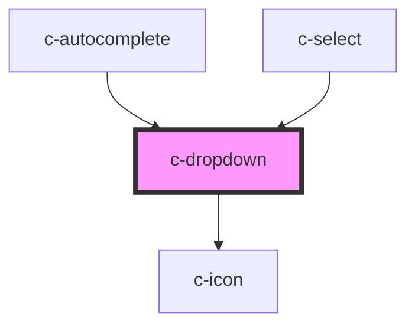

# c-dropdown-options

<!-- Auto Generated Below -->

## Properties

| Property           | Attribute            | Description                         | Type                                                                     | Default     |
| ------------------ | -------------------- | ----------------------------------- | ------------------------------------------------------------------------ | ----------- |
| `dropdownItemType` | `dropdown-item-type` | Type of items                       | `"item" \| "option"`                                                     | `undefined` |
| `hostId`           | `id`                 | Id of the element                   | `string`                                                                 | `undefined` |
| `index`            | `index`              | Current index value                 | `number`                                                                 | `undefined` |
| `items`            | --                   | Dropdown options                    | `CAutocompleteItem[] \| CSelectItem[] \| NodeListOf<HTMLCOptionElement>` | `undefined` |
| `itemsPerPage`     | `items-per-page`     | Items per page before adding scroll | `number`                                                                 | `undefined` |
| `parent`           | --                   | Dropdown parent                     | `HTMLCAutocompleteElement \| HTMLCSelectElement`                         | `undefined` |
| `type`             | `type`               | Type of the parent element          | `"autocomplete" \| "select"`                                             | `undefined` |

## Events

| Event                 | Description                             | Type                   |
| --------------------- | --------------------------------------- | ---------------------- |
| `dropdownStateChange` | Triggered when dropdown opens or closes | `CustomEvent<boolean>` |
| `selectOption`        | Triggered when option is selected       | `CustomEvent<any>`     |

## Methods

### `close() => Promise<void>`

Close dropdown

#### Returns

Type: `Promise<void>`

### `focusItem(index: number) => Promise<void>`

#### Parameters

| Name    | Type     | Description |
| ------- | -------- | ----------- |
| `index` | `number` |             |

#### Returns

Type: `Promise<void>`

### `open() => Promise<void>`

Open dropdown

#### Returns

Type: `Promise<void>`

### `selectItem(index: number) => Promise<boolean>`

Select item

#### Parameters

| Name    | Type     | Description |
| ------- | -------- | ----------- |
| `index` | `number` |             |

#### Returns

Type: `Promise<boolean>`

the disabled status of the input

### `setStatusText(text: string) => Promise<void>`

#### Parameters

| Name   | Type     | Description |
| ------ | -------- | ----------- |
| `text` | `string` |             |

#### Returns

Type: `Promise<void>`

### `updateList(reset?: boolean) => Promise<void>`

Update list items

#### Parameters

| Name    | Type      | Description |
| ------- | --------- | ----------- |
| `reset` | `boolean` |             |

#### Returns

Type: `Promise<void>`

## CSS Custom Properties

| Name                                  | Description                      |
| ------------------------------------- | -------------------------------- |
| `--c-dropdown-background-color`       | Menu background color            |
| `--c-dropdown-background-color-hover` | Menu item hover background color |
| `--c-dropdown-text-color`             | Menu item text color             |
| `--c-dropdown-text-color-active`      | Active menu item text color      |

## Dependencies

### Used by

 - [c-autocomplete](../c-autocomplete)
 - [c-select](../c-select)

### Depends on

- [c-icon](../c-icon)

### Graph

----------------------------------------------

*Built with [StencilJS](https://stenciljs.com/)*
