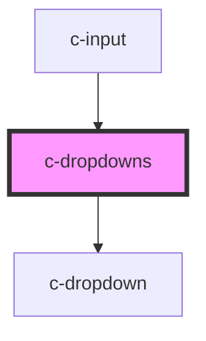

# c-dropdowns

<!-- Auto Generated Below -->

## Methods

### `createDropdown(params: _CDropdownParams) => Promise<HTMLCDropdownElement>`

Creates a dropdown

#### Returns

Type: `Promise<HTMLCDropdownElement>`

## Dependencies

### Used by

 - [c-input](../c-input)

### Depends on

- [c-dropdown](../c-dropdown)

### Graph

----------------------------------------------

*Built with [StencilJS](https://stenciljs.com/)*
