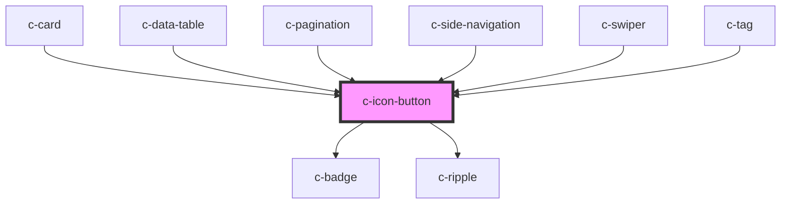

# c-icon-button

<!-- Auto Generated Below -->

## Properties

| Property   | Attribute  | Description                         | Type                                | Default     |
| ---------- | ---------- | ----------------------------------- | ----------------------------------- | ----------- |
| `badge`    | `badge`    | Show a badge on top of the icon     | `string`                            | `undefined` |
| `danger`   | `danger`   | Danger variant of the button        | `boolean`                           | `false`     |
| `disabled` | `disabled` | Disable the button                  | `boolean`                           | `false`     |
| `ghost`    | `ghost`    | Ghost variant of the button         | `boolean`                           | `false`     |
| `inverted` | `inverted` | Inverted color for dark backgrounds | `boolean`                           | `false`     |
| `outlined` | `outlined` | Outlined variant of the button      | `boolean`                           | `false`     |
| `path`     | `path`     | Path for the svg icon               | `string`                            | `null`      |
| `size`     | `size`     | Size of the button                  | `"default" \| "small" \| "x-small"` | `'default'` |
| `text`     | `text`     | Text variant of the button          | `boolean`                           | `false`     |

## Slots

| Slot             | Description               |
| ---------------- | ------------------------- |
| `"Default slot"` | Default slot for the icon |

## CSS Custom Properties

| Name                                                                | Description                                                  |
| ------------------------------------------------------------------- | ------------------------------------------------------------ |
| `--c-icon-button-background-color`                                  | Default icon button background color                         |
| `--c-icon-button-background-color-hover`                            | Default icon button hover background                         |
| `--c-icon-button-badge-background-color`                            | Default icon button badge background color                   |
| `--c-icon-button-badge-border-color`                                | Default icon button badge outline color                      |
| `--c-icon-button-border-radius`                                     | Icon button border radius                                    |
| `--c-icon-button-danger-background-color`                           | Danger icon button background color                          |
| `--c-icon-button-danger-background-color-hover`                     | Danger icon button hover background color                    |
| `--c-icon-button-danger-badge-background-color`                     | Danger icon button badge background color                    |
| `--c-icon-button-danger-badge-border-color`                         | Danger icon button badge border color                        |
| `--c-icon-button-danger-badge-text-color`                           | Danger icon button badge text color                          |
| `--c-icon-button-danger-disabled-background-color`                  | Danger icon button background color                          |
| `--c-icon-button-danger-disabled-background-color-hover`            | Danger icon button hover background color                    |
| `--c-icon-button-danger-disabled-badge-background-color`            | Danger icon button badge background color                    |
| `--c-icon-button-danger-disabled-badge-border-color`                | Danger icon button badge border color                        |
| `--c-icon-button-danger-disabled-badge-text-color`                  | Danger icon button badge text color                          |
| `--c-icon-button-danger-disabled-text-color`                        | Danger icon button text color                                |
| `--c-icon-button-danger-inverted-background-color`                  | Danger icon button background color                          |
| `--c-icon-button-danger-inverted-background-color-hover`            | Danger icon button hover background color                    |
| `--c-icon-button-danger-inverted-badge-background-color`            | Danger icon button badge background color                    |
| `--c-icon-button-danger-inverted-badge-border-color`                | Danger icon button badge border color                        |
| `--c-icon-button-danger-inverted-badge-text-color`                  | Danger icon button badge text color                          |
| `--c-icon-button-danger-inverted-text-color`                        | Danger icon button text color                                |
| `--c-icon-button-danger-text-color`                                 | Danger icon button text color                                |
| `--c-icon-button-disabled-background-color`                         | Disabled default icon button background color                |
| `--c-icon-button-disabled-background-color-hover`                   | Disabled default icon button hover background color          |
| `--c-icon-button-disabled-badge-background-color`                   | Disabled default icon button badge background color          |
| `--c-icon-button-disabled-badge-border-color`                       | Disabled default icon button badge border color              |
| `--c-icon-button-disabled-badge-text-color`                         | Disabled default icon button badge text color                |
| `--c-icon-button-disabled-outline-color`                            | Disabled default icon button outline color                   |
| `--c-icon-button-disabled-text-color`                               | Disabled default icon button text color                      |
| `--c-icon-button-ghost-background-color`                            | Ghost icon button background color                           |
| `--c-icon-button-ghost-background-color-hover`                      | Ghost icon button hover background color                     |
| `--c-icon-button-ghost-badge-background-color`                      | Ghost icon button badge background color                     |
| `--c-icon-button-ghost-badge-border-color`                          | Ghost icon button badge border color                         |
| `--c-icon-button-ghost-badge-text-color`                            | Ghost icon button badge text color                           |
| `--c-icon-button-ghost-disabled-background-color`                   | Disabled ghost icon button background color                  |
| `--c-icon-button-ghost-disabled-background-color-hover`             | Disabled ghost icon button hover background color            |
| `--c-icon-button-ghost-disabled-badge-background-color`             | Disabled ghost icon button badge background color            |
| `--c-icon-button-ghost-disabled-badge-border-color`                 | Disabled ghost icon button badge border color                |
| `--c-icon-button-ghost-disabled-badge-text-color`                   | Disabled ghost icon button badge text color                  |
| `--c-icon-button-ghost-disabled-text-color`                         | Disabled ghost icon button text color                        |
| `--c-icon-button-ghost-inverted-background-color`                   | Inverted ghost icon button background color                  |
| `--c-icon-button-ghost-inverted-background-color-hover`             | Inverted ghost icon button hover background color            |
| `--c-icon-button-ghost-inverted-badge-background-color`             | Inverted ghost icon button badge background color            |
| `--c-icon-button-ghost-inverted-badge-border-color`                 | Inverted ghost icon button badge border border color         |
| `--c-icon-button-ghost-inverted-badge-text-color`                   | Inverted ghost icon button badge text color                  |
| `--c-icon-button-ghost-inverted-disabled-background-color`          | Disabled ghost icon button background color                  |
| `--c-icon-button-ghost-inverted-disabled-badge-background-color`    | Disabled ghost icon button badge background color            |
| `--c-icon-button-ghost-inverted-disabled-badge-border-color`        | Disabled ghost icon button badge border color                |
| `--c-icon-button-ghost-inverted-disabled-badge-text-color`          | Disabled ghost icon button badge text color                  |
| `--c-icon-button-ghost-inverted-disabled-text-color`                | Disabled ghost icon button text color                        |
| `--c-icon-button-ghost-inverted-text-color`                         | Inverted ghost icon button text color                        |
| `--c-icon-button-ghost-text-color`                                  | Ghost icon button text color                                 |
| `--c-icon-button-inverted-background-color`                         | Inverted default button background color                     |
| `--c-icon-button-inverted-background-color-hover`                   | Inverted default button hover background color               |
| `--c-icon-button-inverted-badge-background-color`                   | Iverted default button badge background color                |
| `--c-icon-button-inverted-badge-border-color`                       | Iverted default button badge outline color                   |
| `--c-icon-button-inverted-badge-text-color`                         | Iverted default button badge text color                      |
| `--c-icon-button-inverted-disabled-background-color`                | Disabled inverted default icon button background color       |
| `--c-icon-button-inverted-disabled-badge-background-color`          | Disabled inverted default icon button badge background color |
| `--c-icon-button-inverted-disabled-badge-border-color`              | Disabled inverted default icon button badge border color     |
| `--c-icon-button-inverted-disabled-badge-text-color`                | Disabled inverted default icon button badge text color       |
| `--c-icon-button-inverted-disabled-outline-color`                   | Disabled inverted default icon button outline color          |
| `--c-icon-button-inverted-disabled-text-color`                      | Disabled inverted default icon button text color             |
| `--c-icon-button-inverted-text-color`                               | Iverted default button text color                            |
| `--c-icon-button-outline-color`                                     | Default icon button outline color                            |
| `--c-icon-button-outlined-background-color`                         | Outlined icon button background color                        |
| `--c-icon-button-outlined-background-color-hover`                   | Outlined icon button hover background color                  |
| `--c-icon-button-outlined-badge-background-color`                   | Outlined icon button badge background color                  |
| `--c-icon-button-outlined-badge-border-color`                       | Outlined icon button badge border color                      |
| `--c-icon-button-outlined-badge-text-color`                         | Outlined icon button badge text color                        |
| `--c-icon-button-outlined-border-color`                             | Outlined icon button border color                            |
| `--c-icon-button-outlined-disabled-background-color`                | Disabled outlined icon button background color               |
| `--c-icon-button-outlined-disabled-badge-background-color`          | Disabled outlined icon button badge background color         |
| `--c-icon-button-outlined-disabled-badge-border-color`              | Disabled outlined icon button badge border color             |
| `--c-icon-button-outlined-disabled-badge-text-color`                | Disabled outlined icon button badge text color               |
| `--c-icon-button-outlined-disabled-border-color`                    | Disabled outlined icon button border color                   |
| `--c-icon-button-outlined-disabled-text-color`                      | Disabled outlined icon button text color                     |
| `--c-icon-button-outlined-inverted-background-color`                | Inverted outlined icon button background color               |
| `--c-icon-button-outlined-inverted-background-color-hover`          | INverted outlined icon button hover background color         |
| `--c-icon-button-outlined-inverted-badge-background-color`          | Inverted outlined icon button badge background color         |
| `--c-icon-button-outlined-inverted-badge-border-color`              | Inverted outlined icon button badge border color             |
| `--c-icon-button-outlined-inverted-badge-text-color`                | Inverted outlined icon button badge text color               |
| `--c-icon-button-outlined-inverted-border-color`                    | Inverted outlined icon button border color                   |
| `--c-icon-button-outlined-inverted-disabled-background-color`       | Disabled outlined icon button background color               |
| `--c-icon-button-outlined-inverted-disabled-badge-background-color` | Disabled outlined icon button badge background color         |
| `--c-icon-button-outlined-inverted-disabled-badge-border-color`     | Disabled outlined icon button badge border color             |
| `--c-icon-button-outlined-inverted-disabled-badge-text-color`       | Disabled outlined icon button badge text color               |
| `--c-icon-button-outlined-inverted-disabled-border-color`           | Disabled outlined icon button border color                   |
| `--c-icon-button-outlined-inverted-disabled-text-color`             | Disabled outlined icon button text color                     |
| `--c-icon-button-outlined-inverted-text-color`                      | Inverted outlined icon button text color                     |
| `--c-icon-button-outlined-text-color`                               | Outlined icon button text color                              |
| `--c-icon-button-text-background-color`                             | Text icon button background color                            |
| `--c-icon-button-text-background-color-hover`                       | Text icon button hover background color                      |
| `--c-icon-button-text-badge-background-color`                       | Text icon button badge background color                      |
| `--c-icon-button-text-badge-border-color`                           | Text icon button badge border color                          |
| `--c-icon-button-text-badge-text-color`                             | Text icon button badge text color                            |
| `--c-icon-button-text-color`                                        | Default icon button text color                               |
| `--c-icon-button-text-disabled-background-color`                    | Disabled text icon button background color                   |
| `--c-icon-button-text-disabled-badge-background-color`              | Disabled text icon button badge background color             |
| `--c-icon-button-text-disabled-badge-border-color`                  | Disabled text icon button badge border color                 |
| `--c-icon-button-text-disabled-badge-text-color`                    | Disabled text icon button badge text color                   |
| `--c-icon-button-text-disabled-text-color`                          | Disabled text icon button text color                         |
| `--c-icon-button-text-inverted-disabled-background-color`           | Disabled inverted text icon button background color          |
| `--c-icon-button-text-inverted-disabled-badge-background-color`     | Disabled inverted text icon button badge background color    |
| `--c-icon-button-text-inverted-disabled-badge-border-color`         | Disabled inverted text icon button badge border color        |
| `--c-icon-button-text-inverted-disabled-badge-text-color`           | Disabled inverted text icon button badge text color          |
| `--c-icon-button-text-inverted-disabled-text-color`                 | Disabled inverted text icon button text color                |
| `--c-icon-button-text-text-color`                                   | Text icon button text color                                  |

## Dependencies

### Used by

 - [c-card](../c-card)
 - [c-data-table](../c-data-table)
 - [c-pagination](../c-pagination)
 - [c-side-navigation](../c-side-navigation)
 - [c-swiper](../c-swiper)
 - [c-tag](../c-tag)

### Depends on

- [c-badge](../c-badge)
- [c-ripple](../c-ripple)

### Graph

----------------------------------------------

*Built with [StencilJS](https://stenciljs.com/)*
