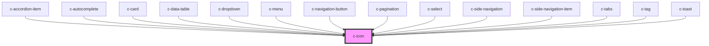

# c-icon

<!-- Auto Generated Below -->

## Properties

| Property | Attribute | Description                | Type     | Default          |
| -------- | --------- | -------------------------- | -------- | ---------------- |
| `color`  | `color`   | Fill color                 | `string` | `'currentColor'` |
| `path`   | `path`    | Svg path d attribute value | `string` | `undefined`      |
| `size`   | `size`    | Icon size in pixels        | `number` | `24`             |

## CSS Custom Properties

| Name             | Description       |
| ---------------- | ----------------- |
| `--c-icon-color` | Color of the icon |

## Dependencies

### Used by

 - [c-accordion-item](../c-accordion-item)
 - [c-autocomplete](../c-autocomplete)
 - [c-card](../c-card)
 - [c-data-table](../c-data-table)
 - [c-dropdown](../c-dropdown)
 - [c-menu](../c-menu)
 - [c-navigation-button](../c-navigation-button)
 - [c-pagination](../c-pagination)
 - [c-select](../c-select)
 - [c-side-navigation](../c-side-navigation)
 - [c-side-navigation-item](../c-side-navigation-item)
 - [c-tabs](../c-tabs)
 - [c-tag](../c-tag)
 - [c-toast](../c-toast)

### Graph

----------------------------------------------

*Built with [StencilJS](https://stenciljs.com/)*
