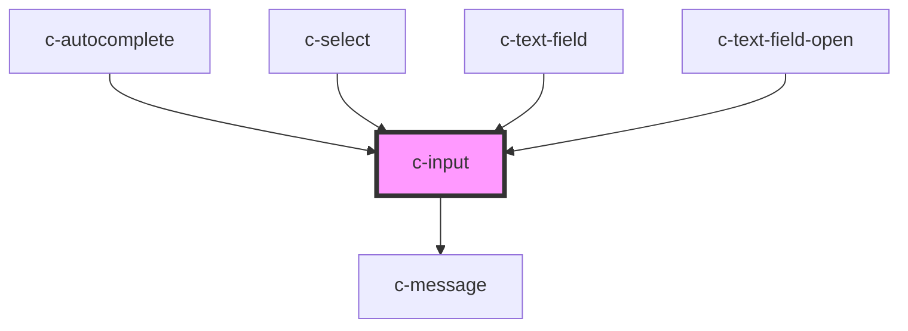

# c-input

<!-- Auto Generated Below -->

## Properties

| Property         | Attribute          | Description                         | Type                                                                                                                                    | Default            |
| ---------------- | ------------------ | ----------------------------------- | --------------------------------------------------------------------------------------------------------------------------------------- | ------------------ |
| `active`         | `active`           | Active state                        | `boolean`                                                                                                                               | `false`            |
| `automaticFocus` | `autofocus`        | Auto focus the input                | `boolean`                                                                                                                               | `false`            |
| `disabled`       | `disabled`         | Disable the input                   | `boolean`                                                                                                                               | `false`            |
| `hideDetails`    | `hide-details`     | Hide the hint and error messages    | `boolean`                                                                                                                               | `false`            |
| `hint`           | `hint`             | Hint text for the input             | `string`                                                                                                                                | `''`               |
| `hostId`         | `id`               | Id of the input                     | `string`                                                                                                                                | `undefined`        |
| `inputId`        | `input-id`         | Id of the input element             | `string`                                                                                                                                | `undefined`        |
| `items`          | --                 | Items for the dropdown              | `CSelectItem[]`                                                                                                                         | `undefined`        |
| `itemsPerPage`   | `items-per-page`   | Items per page before adding scroll | `number`                                                                                                                                | `6`                |
| `label`          | `label`            | Label of the input                  | `string`                                                                                                                                | `undefined`        |
| `labelOnTop`     | `label-on-top`     | Label on top of the input           | `boolean`                                                                                                                               | `false`            |
| `max`            | `max`              | Maximum value on a numeric input    | `number`                                                                                                                                | `null`             |
| `min`            | `min`              | Minimum value on a numeric input    | `number`                                                                                                                                | `null`             |
| `name`           | `name`             | Name of the input                   | `string`                                                                                                                                | `undefined`        |
| `placeholder`    | `placeholder`      | Placeholder of the input            | `string`                                                                                                                                | `undefined`        |
| `readonly`       | `readonly`         | Mark as readonly                    | `boolean`                                                                                                                               | `false`            |
| `required`       | `required`         | Set the input as required           | `boolean`                                                                                                                               | `false`            |
| `rows`           | `rows`             | Rows on the input                   | `number`                                                                                                                                | `1`                |
| `shadow`         | `shadow`           | Shadow variant of the input         | `boolean`                                                                                                                               | `false`            |
| `step`           | `step`             | Step size on a numeric input        | `number`                                                                                                                                | `null`             |
| `type`           | `type`             | Type of the input                   | `string`                                                                                                                                | `undefined`        |
| `valid`          | `valid`            | Set the validíty of the input       | `boolean`                                                                                                                               | `true`             |
| `validate`       | `validate`         | Manual validation                   | `boolean`                                                                                                                               | `false`            |
| `validateOnBlur` | `validate-on-blur` | Validate the input on blur          | `boolean`                                                                                                                               | `false`            |
| `validation`     | `validation`       | Custom validation message           | `string`                                                                                                                                | `'Required field'` |
| `value`          | `value`            | Value of the input                  | `CSelectItem & { ref?: HTMLElement; } \| boolean \| number \| string \| { name: string; value: string \| number; disabled?: boolean; }` | `undefined`        |
| `variant`        | `variant`          | Variant                             | `"select" \| "text"`                                                                                                                    | `'text'`           |

## Events

| Event           | Description                | Type               |
| --------------- | -------------------------- | ------------------ |
| `changeValue`   | Emit changes to the parent | `CustomEvent<any>` |
| `dropdownClose` | Emit close to the parent   | `CustomEvent<any>` |
| `itemClick`     | Emit click to the parent   | `CustomEvent<any>` |

## Methods

### `reset() => Promise<void>`

#### Returns

Type: `Promise<void>`

## Dependencies

### Used by

 - [c-autocomplete](../c-autocomplete)
 - [c-select](../c-select)
 - [c-text-field](../c-text-field)
 - [c-text-field-open](../c-text-field-open)

### Depends on

- [c-message](../c-message)

### Graph

----------------------------------------------

*Built with [StencilJS](https://stenciljs.com/)*
