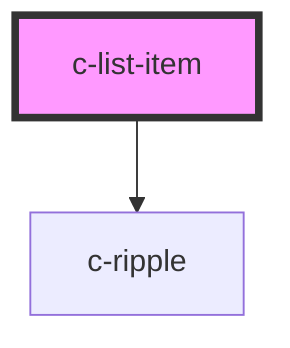

# c-list-item

<!-- Auto Generated Below -->

## Properties

| Property           | Attribute            | Description                       | Type      | Default     |
| ------------------ | -------------------- | --------------------------------- | --------- | ----------- |
| `active`           | `active`             | Set the item active               | `boolean` | `false`     |
| `disabled`         | `disabled`           | Disable the item                  | `boolean` | `false`     |
| `disabledByParent` | `disabled-by-parent` | Disabled by the parent list       | `boolean` | `false`     |
| `hoverable`        | `hoverable`          | Display background color on hover | `boolean` | `false`     |
| `href`             | `href`               | Hyperlink url                     | `string`  | `undefined` |
| `ripple`           | `ripple`             | Add ripple effect to the item     | `boolean` | `false`     |
| `target`           | `target`             | Hyperlink target                  | `string`  | `'_blank'`  |

## Dependencies

### Depends on

- [c-ripple](../c-ripple)

### Graph

----------------------------------------------

*Built with [StencilJS](https://stenciljs.com/)*
