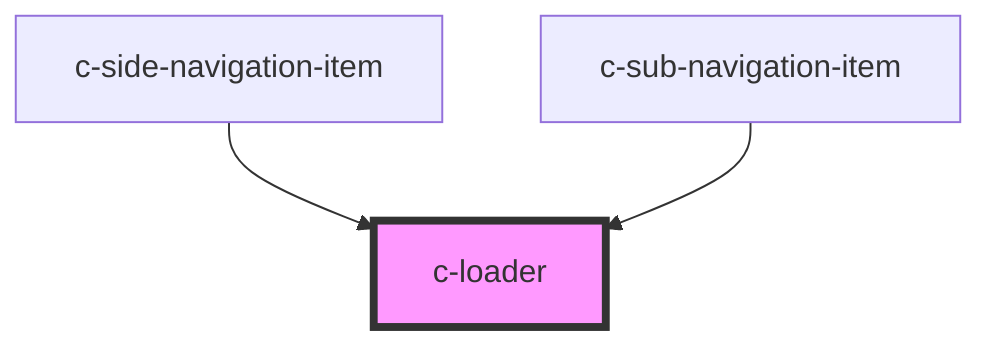

# c-loader

<!-- Auto Generated Below -->

## Overview

A loader component that fills the nearest containing element that has css-property position set to 'relative'

## Properties

| Property       | Attribute      | Description                                                        | Type      | Default |
| -------------- | -------------- | ------------------------------------------------------------------ | --------- | ------- |
| `contentdelay` | `contentdelay` | Delay in seconds of showing the contents in the slot of the loader | `number`  | `0`     |
| `hide`         | `hide`         | Hide the loader                                                    | `boolean` | `false` |
| `size`         | `size`         | Size of the loader                                                 | `number`  | `48`    |

## Dependencies

### Used by

 - [c-side-navigation-item](../c-side-navigation-item)
 - [c-sub-navigation-item](../c-sub-navigation-item)

### Graph

----------------------------------------------

*Built with [StencilJS](https://stenciljs.com/)*
