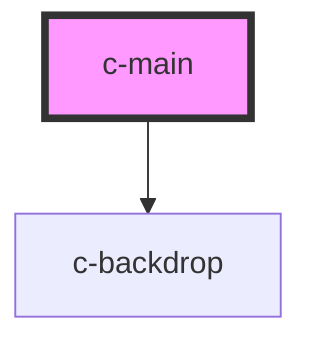

# c-main

<!-- Auto Generated Below -->

## Overview

Wrapper component for the whole page

## Properties

| Property        | Attribute        | Description                          | Type      | Default |
| --------------- | ---------------- | ------------------------------------ | --------- | ------- |
| `disableLayout` | `disable-layout` | Disable the default dashboard layout | `boolean` | `false` |

## Slots

| Slot             | Description          |
| ---------------- | -------------------- |
| `"Default slot"` | Contents of the page |

## CSS Custom Properties

| Name                        | Description      |
| --------------------------- | ---------------- |
| `--c-main-background-color` | Background color |
| `--c-main-text-color`       | Text color       |

## Dependencies

### Depends on

- [c-backdrop](../c-backdrop)

### Graph

----------------------------------------------

*Built with [StencilJS](https://stenciljs.com/)*
