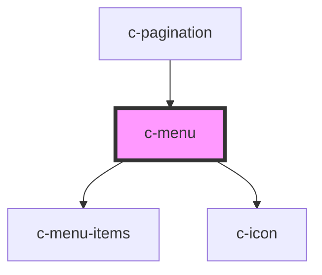

# c-menu

<!-- Auto Generated Below -->

## Properties

| Property       | Attribute        | Description                                                    | Type            | Default |
| -------------- | ---------------- | -------------------------------------------------------------- | --------------- | ------- |
| `contentClass` | `content-class`  | Menu content css class                                         | `string`        | `''`    |
| `custom`       | `custom`         | No chevron and background, E.g. when a button is the activator | `boolean`       | `false` |
| `flat`         | `flat`           | No hover background                                            | `boolean`       | `false` |
| `items`        | --               | Menu items                                                     | `CMenuOption[]` | `[]`    |
| `itemsPerPage` | `items-per-page` | Items per page before adding scroll                            | `number`        | `6`     |
| `small`        | `small`          | Small variant                                                  | `boolean`       | `false` |

## Slots

| Slot             | Description                                     |
| ---------------- | ----------------------------------------------- |
| `"Default slot"` | Menu title / activator element (simple variant) |

## Dependencies

### Used by

 - [c-pagination](../c-pagination)

### Depends on

- [c-menu-items](../c-menu-items)
- [c-icon](../c-icon)

### Graph

----------------------------------------------

*Built with [StencilJS](https://stenciljs.com/)*
