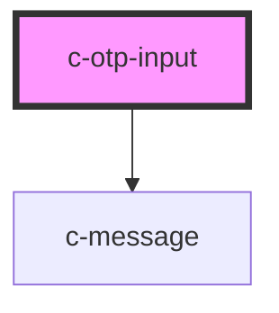

# c-otp-input

<!-- Auto Generated Below -->

## Properties

| Property                 | Attribute      | Description                      | Type      | Default            |
| ------------------------ | -------------- | -------------------------------- | --------- | ------------------ |
| `elementId` _(required)_ | `id`           | Id of the element                | `string`  | `undefined`        |
| `hideDetails`            | `hide-details` | Hide the hint and error messages | `boolean` | `false`            |
| `hint`                   | `hint`         | Hint text for the input          | `string`  | `''`               |
| `length`                 | `length`       | Length of the OTP code           | `number`  | `6`                |
| `valid`                  | `valid`        | Set the validíty of the input    | `boolean` | `true`             |
| `validation`             | `validation`   | Custom validation message        | `string`  | `'Required field'` |

## Events

| Event         | Description                                   | Type                  |
| ------------- | --------------------------------------------- | --------------------- |
| `changeValue` | Run on input - returns the current value      | `CustomEvent<string>` |
| `completion`  | Run on completion - returns the current value | `CustomEvent<string>` |

## CSS Custom Properties

| Name                                | Description                   |
| ----------------------------------- | ----------------------------- |
| `--c-otp-input-border-color`        | OTP input border color        |
| `--c-otp-input-border-color-active` | Active OTP input border color |
| `--c-otp-input-font-size`           | OTP input font size           |
| `--c-otp-input-height`              | OTP input height              |
| `--c-otp-input-text-color`          | OTP input text color          |
| `--c-otp-input-width`               | OTP input width               |

## Dependencies

### Depends on

- [c-message](../c-message)

### Graph

----------------------------------------------

*Built with [StencilJS](https://stenciljs.com/)*
