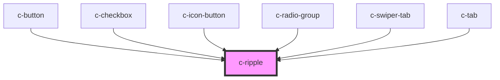

# c-ripple

<!-- Auto Generated Below -->

## Properties

| Property   | Attribute  | Description              | Type      | Default |
| ---------- | ---------- | ------------------------ | --------- | ------- |
| `circular` | `circular` | Create a circular ripple | `boolean` | `false` |

## Methods

### `createRipple(event: MouseEvent, parent: HTMLElement, center?: boolean) => Promise<void>`

Creates a ripple

#### Returns

Type: `Promise<void>`

## Dependencies

### Used by

 - [c-button](../c-button)
 - [c-checkbox](../c-checkbox)
 - [c-icon-button](../c-icon-button)
 - [c-radio-group](../c-radio-group)
 - [c-swiper-tab](../c-swiper-tab)
 - [c-tab](../c-tab)

### Graph

----------------------------------------------

*Built with [StencilJS](https://stenciljs.com/)*
