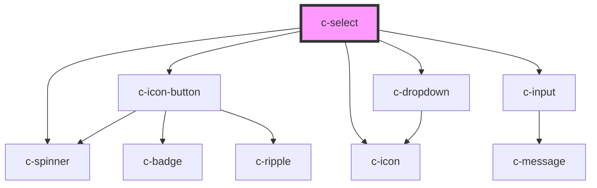

# c-select

<!-- Auto Generated Below -->

## Properties

| Property            | Attribute             | Description                                                                  | Type                                                                                 | Default            |
| ------------------- | --------------------- | ---------------------------------------------------------------------------- | ------------------------------------------------------------------------------------ | ------------------ |
| `clearable`         | `clearable`           | Make the selected value clearable                                            | `boolean`                                                                            | `false`            |
| `disabled`          | `disabled`            | Disable the input                                                            | `boolean`                                                                            | `false`            |
| `hideDetails`       | `hide-details`        | Hide the hint and error messages                                             | `boolean`                                                                            | `false`            |
| `hint`              | `hint`                | Hint text for the input                                                      | `string`                                                                             | `''`               |
| `hostId`            | `id`                  | Id of the element                                                            | `string`                                                                             | `undefined`        |
| `items`             | --                    | Dropdown items                                                               | `CSelectItem[]`                                                                      | `[]`               |
| `itemsPerPage`      | `items-per-page`      | Items per page before adding scroll                                          | `number`                                                                             | `6`                |
| `label`             | `label`               | Element label                                                                | `string`                                                                             | `undefined`        |
| `loading`           | `loading`             | Show loading state                                                           | `boolean`                                                                            | `false`            |
| `name`              | `name`                | Input field name                                                             | `string`                                                                             | `undefined`        |
| `optionAsSelection` | `option-as-selection` | display the option as selection (works only when c-option elements are used) | `boolean`                                                                            | `undefined`        |
| `placeholder`       | `placeholder`         | Placeholder text                                                             | `string`                                                                             | `''`               |
| `required`          | `required`            | Show required validation                                                     | `boolean`                                                                            | `false`            |
| `returnObject`      | `return-object`       | Return object instead of value                                               | `boolean`                                                                            | `false`            |
| `shadow`            | `shadow`              | Shadow variant                                                               | `boolean`                                                                            | `false`            |
| `valid`             | `valid`               | Set the validíty of the input                                                | `boolean`                                                                            | `true`             |
| `validate`          | `validate`            | Manual validation                                                            | `boolean`                                                                            | `false`            |
| `validateOnBlur`    | `validate-on-blur`    | Validate the input on blur                                                   | `boolean`                                                                            | `false`            |
| `validation`        | `validation`          | Custom validation message                                                    | `string`                                                                             | `'Required field'` |
| `value`             | `value`               | Selected item                                                                | `number \| string \| { name: string; value: string \| number; disabled?: boolean; }` | `null`             |

## Events

| Event          | Description                       | Type               |
| -------------- | --------------------------------- | ------------------ |
| `change-value` | Triggered when option is selected | `CustomEvent<any>` |

## Methods

### `reset() => Promise<void>`

Reset select state

#### Returns

Type: `Promise<void>`

## Slots

| Slot             | Description                |
| ---------------- | -------------------------- |
| `"Default slot"` | Use c-option elements only |

## CSS Custom Properties

| Name                                       | Description                          |
| ------------------------------------------ | ------------------------------------ |
| `--c-select-active-color`                  | Active select color                  |
| `--c-select-background-color`              | Inactive select background color     |
| `--c-select-inactive-color`                | Inactive select color                |
| `--c-select-option-background-color`       | Select option background color       |
| `--c-select-option-background-color-hover` | Select option hover background color |
| `--c-select-option-text-color`             | Select option text color             |
| `--c-select-placeholder-color`             | Select placeholder color             |
| `--c-select-text-color`                    | Select text color                    |

## Dependencies

### Depends on

- [c-spinner](../c-spinner)
- [c-icon-button](../c-icon-button)
- [c-icon](../c-icon)
- [c-dropdown](../c-dropdown)
- [c-input](../c-input)

### Graph

----------------------------------------------

*Built with [StencilJS](https://stenciljs.com/)*
