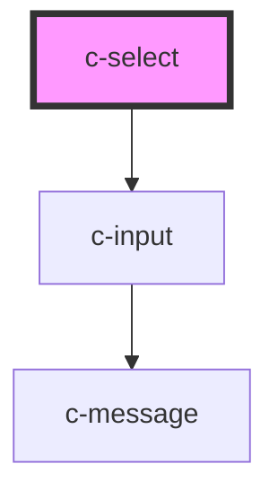

# c-select

<!-- Auto Generated Below -->

## Properties

| Property            | Attribute             | Description                                                                  | Type                                         | Default            |
| ------------------- | --------------------- | ---------------------------------------------------------------------------- | -------------------------------------------- | ------------------ |
| `autofocus`         | `autofocus`           | Auto focus the input                                                         | `boolean`                                    | `false`            |
| `disabled`          | `disabled`            | Disable the input                                                            | `boolean`                                    | `false`            |
| `hideDetails`       | `hide-details`        | Hide the hint and error messages                                             | `boolean`                                    | `false`            |
| `hint`              | `hint`                | Hint text for the input                                                      | `string`                                     | `''`               |
| `hostId`            | `id`                  | Id of the element                                                            | `string`                                     | `undefined`        |
| `items`             | --                    | selectable items                                                             | `CSelectItem[]`                              | `[]`               |
| `itemsPerPage`      | `items-per-page`      | Items per page before adding scroll                                          | `number`                                     | `6`                |
| `label`             | `label`               | Element label                                                                | `string`                                     | `undefined`        |
| `name`              | `name`                | Input field name                                                             | `string`                                     | `undefined`        |
| `optionAsSelection` | `option-as-selection` | display the option as selection (works only when c-option elements are used) | `boolean`                                    | `undefined`        |
| `placeholder`       | `placeholder`         | Placeholder text                                                             | `string`                                     | `''`               |
| `required`          | `required`            | Set as required                                                              | `boolean`                                    | `false`            |
| `returnValue`       | `return-value`        | Return only the item value rather than the whole item object                 | `boolean`                                    | `undefined`        |
| `shadow`            | `shadow`              | Shadow variant                                                               | `boolean`                                    | `false`            |
| `valid`             | `valid`               | Set the validity of the input                                                | `boolean`                                    | `true`             |
| `validate`          | `validate`            | Manual validation                                                            | `boolean`                                    | `false`            |
| `validateOnBlur`    | `validate-on-blur`    | Validate the input on blur                                                   | `boolean`                                    | `false`            |
| `validation`        | `validation`          | Custom validation message                                                    | `string`                                     | `'Required field'` |
| `value`             | `value`               | Selected item                                                                | `CSelectItem \| boolean \| number \| string` | `null`             |

## Events

| Event         | Description                        | Type               |
| ------------- | ---------------------------------- | ------------------ |
| `changeValue` | Triggered when an item is selected | `CustomEvent<any>` |

## Slots

| Slot             | Description                |
| ---------------- | -------------------------- |
| `"Default slot"` | Use c-option elements only |

## CSS Custom Properties

| Name                                       | Description                          |
| ------------------------------------------ | ------------------------------------ |
| `--c-select-active-color`                  | Active text field color              |
| `--c-select-background-color`              | Inactive text field background color |
| `--c-select-inactive-color`                | Inactive text field color            |
| `--c-select-option-background-color`       | Select option background color       |
| `--c-select-option-background-color-hover` | Select option hover background color |
| `--c-select-placeholder-color`             | Text field placeholder color         |
| `--c-select-text-color`                    | Text field text color                |

## Dependencies

### Depends on

- [c-input](../c-input)

### Graph

----------------------------------------------

*Built with [StencilJS](https://stenciljs.com/)*
