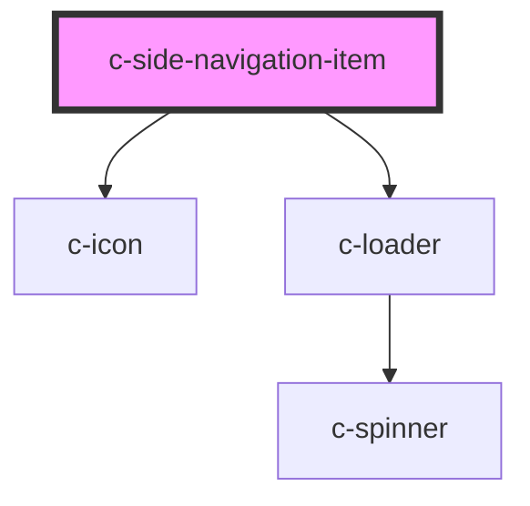

# c-side-navigation-item

<!-- Auto Generated Below -->

## Properties

| Property  | Attribute | Description           | Type      | Default     |
| --------- | --------- | --------------------- | --------- | ----------- |
| `active`  | `active`  | Indicate active state | `boolean` | `undefined` |
| `href`    | `href`    | Hyperlink url         | `string`  | `undefined` |
| `loading` | `loading` | Loading state         | `boolean` | `false`     |
| `target`  | `target`  | Hyperlink target      | `string`  | `null`      |

## Events

| Event        | Description                     | Type               |
| ------------ | ------------------------------- | ------------------ |
| `itemChange` | Emit changes to the c-accordion | `CustomEvent<any>` |

## CSS Custom Properties

| Name                                                        | Description                                  |
| ----------------------------------------------------------- | -------------------------------------------- |
| `--c-side-navigation-item-background-color`                 | Side navigation item background color        |
| `--c-side-navigation-item-background-color-active`          | Active side navigation item background color |
| `--c-side-navigation-item-background-color-hover`           | Side navigation item hover background color  |
| `--c-side-navigation-item-outline-color`                    | Side navigation item outline color           |
| `--c-side-navigation-item-sub-item-background-color`        | 2nd level item background color              |
| `--c-side-navigation-item-sub-item-background-color-active` | Active 2nd level item background color       |
| `--c-side-navigation-item-sub-item-background-color-hover`  | 2nd level item hover background color        |
| `--c-side-navigation-item-sub-item-text-color`              | 2nd level item text color                    |
| `--c-side-navigation-item-sub-item-text-color-active`       | Active 2nd level item text color             |
| `--c-side-navigation-item-text-color`                       | Side navigation item text color              |
| `--c-side-navigation-item-text-color-active`                | Active side navigation item text color       |

## Dependencies

### Depends on

- [c-icon](../c-icon)
- [c-loader](../c-loader)

### Graph

----------------------------------------------

*Built with [StencilJS](https://stenciljs.com/)*
