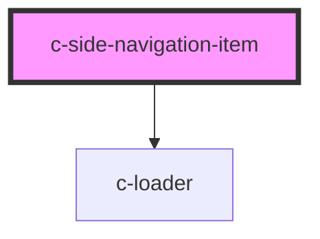

# c-side-navigation-item

<!-- Auto Generated Below -->

## Properties

| Property  | Attribute | Description           | Type      | Default     |
| --------- | --------- | --------------------- | --------- | ----------- |
| `active`  | `active`  | Indicate active state | `boolean` | `undefined` |
| `href`    | `href`    | Hyperlink url         | `string`  | `undefined` |
| `loading` | `loading` | Loading state         | `boolean` | `false`     |
| `target`  | `target`  | Hyperlink target      | `string`  | `null`      |

## Events

| Event        | Description                     | Type               |
| ------------ | ------------------------------- | ------------------ |
| `itemChange` | Emit changes to the c-accordion | `CustomEvent<any>` |

## CSS Custom Properties

| Name                                               | Description                                  |
| -------------------------------------------------- | -------------------------------------------- |
| `--c-side-navigation-item-active-background-color` | Side navigation item active background color |
| `--c-side-navigation-item-active-text-color`       | Side navigation item active text color       |
| `--c-side-navigation-item-hover-background-color`  | Side navigation item hover background color  |

## Dependencies

### Depends on

- [c-loader](../c-loader)

### Graph

----------------------------------------------

*Built with [StencilJS](https://stenciljs.com/)*
