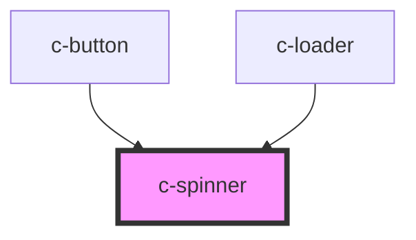

# c-spinner

<!-- Auto Generated Below -->

## Properties

| Property | Attribute | Description          | Type     | Default                  |
| -------- | --------- | -------------------- | -------- | ------------------------ |
| `color`  | `color`   | Color of the spinner | `string` | `'var(--c-primary-600)'` |
| `size`   | `size`    | Size of the spinner  | `number` | `24`                     |
| `width`  | `width`   | Width of the spinner | `number` | `2`                      |

## CSS Custom Properties

| Name                | Description   |
| ------------------- | ------------- |
| `--c-spinner-color` | Spinner color |

## Dependencies

### Used by

 - [c-button](../c-button)
 - [c-loader](../c-loader)

### Graph

----------------------------------------------

*Built with [StencilJS](https://stenciljs.com/)*
