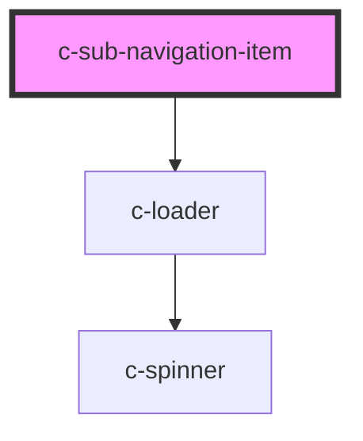

# c-sub-navigation-item

<!-- Auto Generated Below -->

## Properties

| Property    | Attribute   | Description                      | Type      | Default     |
| ----------- | ----------- | -------------------------------- | --------- | ----------- |
| `active`    | `active`    | Active state                     | `boolean` | `undefined` |
| `focusable` | `focusable` | Element is visible and focusable | `boolean` | `false`     |
| `href`      | `href`      | Link url                         | `string`  | `undefined` |
| `loading`   | `loading`   | Loading state                    | `boolean` | `false`     |
| `target`    | `target`    | Link target                      | `string`  | `null`      |

## CSS Custom Properties

| Name                                                       | Description                                 |
| ---------------------------------------------------------- | ------------------------------------------- |
| `--c-sub-navigation-item-background-color-active`          | Sub navigation item active background color |
| `--c-sub-navigation-item-background-color-hover`           | Sub navigation item hover background color  |
| `--c-sub-navigation-item-sub-item-background-color`        | 3rd level item background color             |
| `--c-sub-navigation-item-sub-item-background-color-active` | Active 3rd level item background color      |
| `--c-sub-navigation-item-sub-item-background-color-hover`  | 3rd level item hover background color       |
| `--c-sub-navigation-item-sub-item-text-color`              | 3rd level item text color                   |
| `--c-sub-navigation-item-sub-item-text-color-active`       | Active 3rd level item text color            |
| `--c-sub-navigation-item-text-color`                       | Sub navigation item text color              |
| `--c-sub-navigation-item-text-color-active`                | Sub navigation item active text color       |

## Dependencies

### Depends on

- [c-loader](../c-loader)

### Graph

----------------------------------------------

*Built with [StencilJS](https://stenciljs.com/)*
