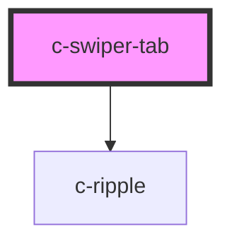

# c-tab

<!-- Auto Generated Below -->

## Properties

| Property   | Attribute  | Description         | Type               | Default     |
| ---------- | ---------- | ------------------- | ------------------ | ----------- |
| `active`   | `active`   | Mark as active      | `boolean`          | `false`     |
| `disabled` | `disabled` | Disable button      | `boolean`          | `false`     |
| `hostId`   | `id`       | Id of the button    | `string`           | `undefined` |
| `label`    | `label`    | Label of the button | `string`           | `undefined` |
| `position` | `position` | Position in the set | `number`           | `undefined` |
| `setsize`  | `setsize`  | Size of the set     | `number`           | `undefined` |
| `value`    | `value`    | Value of the button | `number \| string` | `undefined` |

## Events

| Event         | Description                     | Type                            |
| ------------- | ------------------------------- | ------------------------------- |
| `changeValue` | Emit value change to the parent | `CustomEvent<number \| string>` |

## CSS Custom Properties

| Name                                       | Description                      |
| ------------------------------------------ | -------------------------------- |
| `--c-swiper-tab-background-color`          | Swiper background color          |
| `--c-swiper-tab-background-color-active`   | Swiper active background color   |
| `--c-swiper-tab-background-color-disabled` | Swiper disabled background color |
| `--c-swiper-tab-hover-color`               | Swiper hover color               |
| `--c-swiper-tab-text-color`                | Swiper text color                |
| `--c-swiper-tab-text-color-active`         | Swiper active text color         |
| `--c-swiper-tab-text-color-disabled`       | Swiper disabled text color       |

## Dependencies

### Depends on

- [c-ripple](../c-ripple)

### Graph

----------------------------------------------

*Built with [StencilJS](https://stenciljs.com/)*
