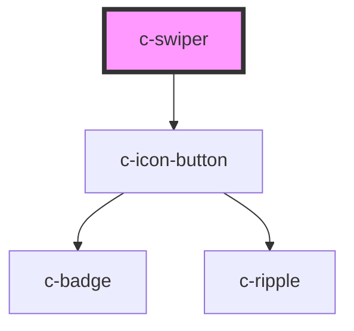

# c-tab-buttons

<!-- Auto Generated Below -->

## Properties

| Property                 | Attribute | Description              | Type               | Default     |
| ------------------------ | --------- | ------------------------ | ------------------ | ----------- |
| `elementId` _(required)_ | `id`      | Id of the swiper element | `string`           | `undefined` |
| `value`                  | `value`   | Value of the swiper      | `number \| string` | `undefined` |

## Events

| Event         | Description                     | Type                            |
| ------------- | ------------------------------- | ------------------------------- |
| `changeValue` | Emit value change to the parent | `CustomEvent<number \| string>` |

## Slots

| Slot             | Description                                |
| ---------------- | ------------------------------------------ |
| `"Default slot"` | Default slot for the c-swiper-tab elements |

## CSS Custom Properties

| Name                                   | Description                      |
| -------------------------------------- | -------------------------------- |
| `--c-swiper-active-background-color`   | Swiper active background color   |
| `--c-swiper-active-text-color`         | Swiper active text color         |
| `--c-swiper-background-color`          | Swiper background color          |
| `--c-swiper-disabled-background-color` | Swiper disabled background color |
| `--c-swiper-disabled-text-color`       | Swiper disabled text color       |
| `--c-swiper-hover-color`               | Swiper hover color               |
| `--c-swiper-text-color`                | Swiper text color                |

## Dependencies

### Depends on

- [c-icon-button](../c-icon-button)

### Graph

----------------------------------------------

*Built with [StencilJS](https://stenciljs.com/)*
