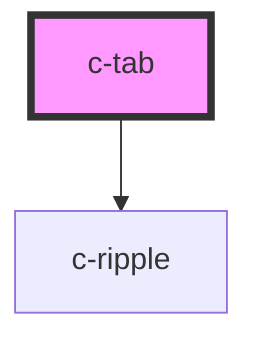

# c-tab

<!-- Auto Generated Below -->

## Properties

| Property   | Attribute  | Description                           | Type               | Default     |
| ---------- | ---------- | ------------------------------------- | ------------------ | ----------- |
| `active`   | `active`   | Mark tab as active                    | `boolean`          | `false`     |
| `disabled` | `disabled` | Mark tab as disabled                  | `boolean`          | `false`     |
| `hostId`   | `id`       | Id of the tab                         | `string`           | `undefined` |
| `position` | `position` | Position in the set                   | `number`           | `undefined` |
| `setsize`  | `setsize`  | Size of the set                       | `number`           | `undefined` |
| `value`    | `value`    | Value for the tab - for use in c-tabs | `number \| string` | `undefined` |

## Events

| Event       | Description                | Type               |
| ----------- | -------------------------- | ------------------ |
| `tabChange` | Emit changes to the parent | `CustomEvent<any>` |

## Slots

| Slot             | Description  |
| ---------------- | ------------ |
| `"Default slot"` | Default slot |

## CSS Custom Properties

| Name                             | Description                    |
| -------------------------------- | ------------------------------ |
| `--c-tab-active-border-color`    | Active tab bottom border color |
| `--c-tab-background-color-hover` | Tab hover background color     |
| `--c-tab-outline-color`          | Tab outline color              |
| `--c-tab-text-color`             | Tab text color                 |

## Dependencies

### Depends on

- [c-ripple](../c-ripple)

### Graph

----------------------------------------------

*Built with [StencilJS](https://stenciljs.com/)*
