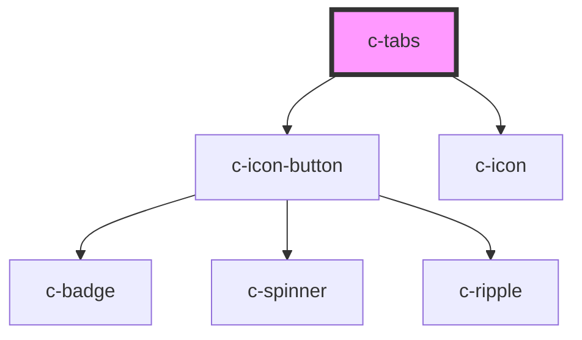

# c-tabs

<!-- Auto Generated Below -->

## Properties

| Property             | Attribute           | Description                                                                       | Type                                        | Default     |
| -------------------- | ------------------- | --------------------------------------------------------------------------------- | ------------------------------------------- | ----------- |
| `borderless`         | `borderless`        | Disable the bottom border                                                         | `boolean`                                   | `false`     |
| `disableAnimation`   | `disable-animation` | Disable animation                                                                 | `boolean`                                   | `false`     |
| `justify`            | `justify`           | Justification of the children                                                     | `"center" \| "end" \| "start" \| "stretch"` | `'stretch'` |
| `mobileBreakpoint`   | `mobile-breakpoint` | Mobile breakpoint in pixels - affects the content stacking with the vertical tabs | `number`                                    | `640`       |
| `value` _(required)_ | `value`             | Currently active tab                                                              | `number \| string`                          | `undefined` |
| `vertical`           | `vertical`          | Vertical tabs                                                                     | `boolean`                                   | `false`     |

## Events

| Event         | Description                | Type               |
| ------------- | -------------------------- | ------------------ |
| `changeValue` | Emit changes to the parent | `CustomEvent<any>` |

## Slots

| Slot             | Description  |
| ---------------- | ------------ |
| `"Default slot"` | Default slot |

## CSS Custom Properties

| Name                       | Description         |
| -------------------------- | ------------------- |
| `--c-tabs-border-color`    | Tabs border color   |
| `--c-tabs-indicator-color` | Tab indicator color |

## Dependencies

### Depends on

- [c-icon-button](../c-icon-button)
- [c-icon](../c-icon)

### Graph

----------------------------------------------

*Built with [StencilJS](https://stenciljs.com/)*
