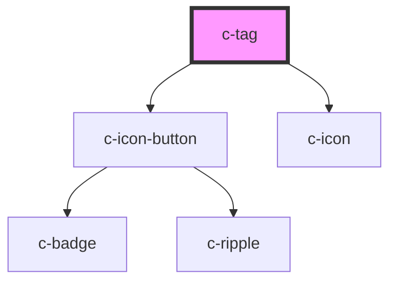

# c-tag

<!-- Auto Generated Below -->

## Properties

| Property    | Attribute   | Description                                       | Type               | Default |
| ----------- | ----------- | ------------------------------------------------- | ------------------ | ------- |
| `active`    | `active`    | Mark tag as active                                | `boolean`          | `false` |
| `badge`     | `badge`     | Display an optional badge at the start of the tag | `number \| string` | `null`  |
| `block`     | `block`     | Stretch to fill the container row                 | `boolean`          | `false` |
| `closeable` | `closeable` | Mark tag as closeable                             | `boolean`          | `false` |
| `fit`       | `fit`       | Stretch to fill the container                     | `boolean`          | `false` |
| `flat`      | `flat`      | Remove the hover effect                           | `boolean`          | `false` |

## Events

| Event   | Description                          | Type               |
| ------- | ------------------------------------ | ------------------ |
| `close` | Emit close event on close icon click | `CustomEvent<any>` |

## Slots

| Slot             | Description  |
| ---------------- | ------------ |
| `"Default slot"` | Default slot |

## CSS Custom Properties

| Name                                    | Description                             |
| --------------------------------------- | --------------------------------------- |
| `--c-tag-background-color`              | Tag background color                    |
| `--c-tag-background-color-active`       | Tag background color if active          |
| `--c-tag-background-color-hover`        | Tag background color on hover           |
| `--c-tag-background-color-hover-active` | Tag background color on hover if active |
| `--c-tag-badge-background-color`        | Tag badge background color              |
| `--c-tag-badge-background-color-active` | Tag badge background color if active    |
| `--c-tag-badge-text-color`              | Tag badge text color                    |
| `--c-tag-badge-text-color-active`       | Tag badge text color if active          |
| `--c-tag-border-color`                  | Tag border color                        |
| `--c-tag-text-color`                    | Tag text color                          |
| `--c-tag-text-color-active`             | Tag text color if active                |

## Dependencies

### Depends on

- [c-icon-button](../c-icon-button)
- [c-icon](../c-icon)

### Graph

----------------------------------------------

*Built with [StencilJS](https://stenciljs.com/)*
