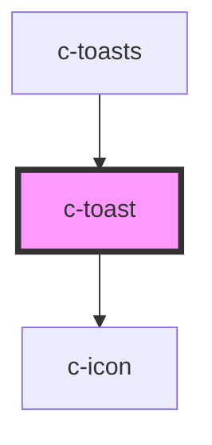

# c-toast

<!-- Auto Generated Below -->

## Properties

| Property  | Attribute | Description | Type                                                                                                                                                                                                                          | Default     |
| --------- | --------- | ----------- | ----------------------------------------------------------------------------------------------------------------------------------------------------------------------------------------------------------------------------- | ----------- |
| `message` | --        | Messages    | `{ message: string; title?: string; type?: CToastType; duration?: number; persistent?: boolean; position?: CToastPosition; id?: string; closeText?: string; indeterminate?: boolean; progress?: boolean; custom?: boolean; }` | `undefined` |

## Events

| Event   | Description                       | Type                                                                                                                                                                                                                                       |
| ------- | --------------------------------- | ------------------------------------------------------------------------------------------------------------------------------------------------------------------------------------------------------------------------------------------ |
| `close` | Emit inner value change to parent | `CustomEvent<{ message: string; title?: string; type?: CToastType; duration?: number; persistent?: boolean; position?: CToastPosition; id?: string; closeText?: string; indeterminate?: boolean; progress?: boolean; custom?: boolean; }>` |

## Methods

### `closeToast() => Promise<void>`

Close toast

#### Returns

Type: `Promise<void>`

## Dependencies

### Used by

 - [c-toasts](../c-toasts)

### Depends on

- [c-icon](../c-icon)

### Graph

----------------------------------------------

*Built with [StencilJS](https://stenciljs.com/)*
